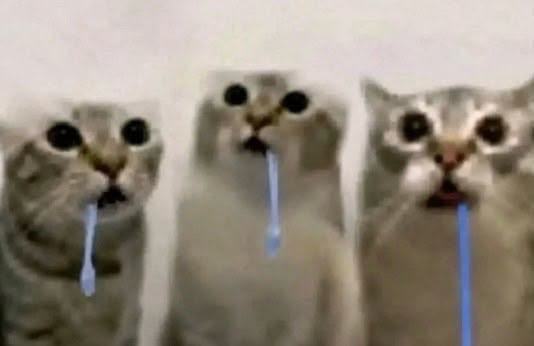
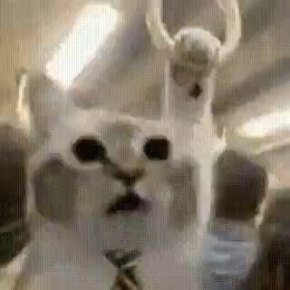
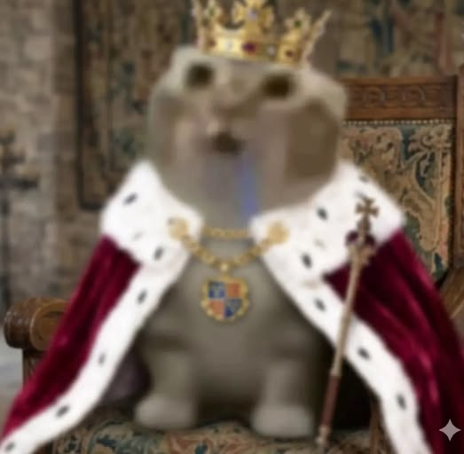
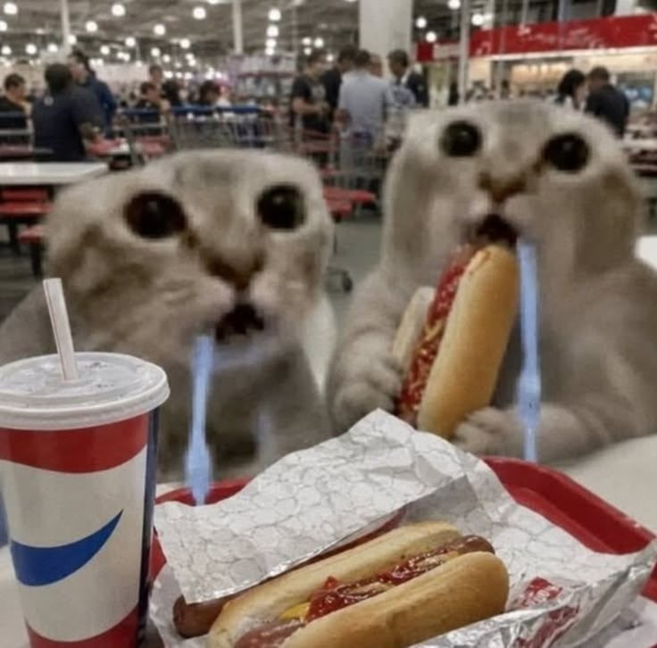
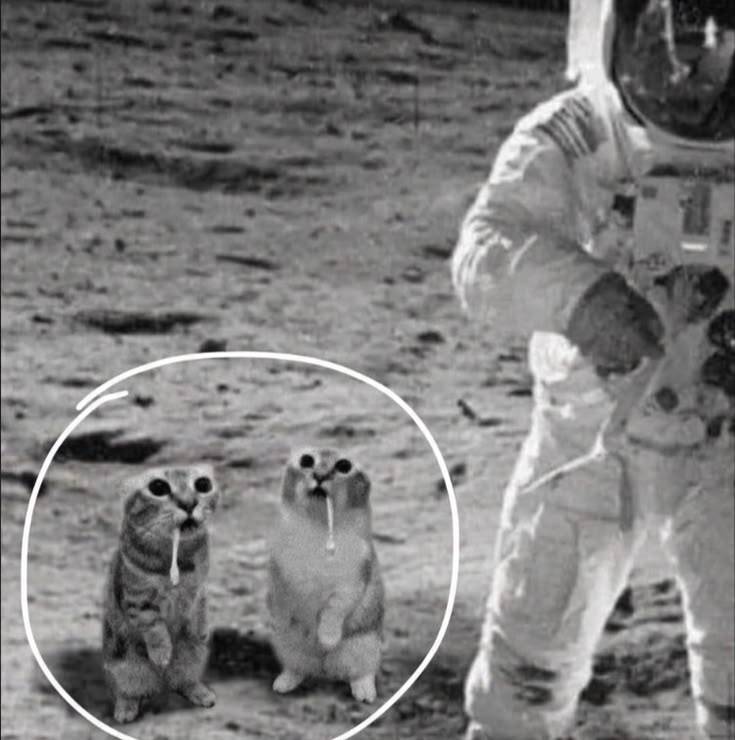

# 🐱💧 The Ultimate Drooling Cat Archive

> "When you see something so good your last two brain cells file for divorce."  
> — Every Drooling Cat enjoyer, 2026

**The official (unofficial) museum of the internet's favorite brain-melt reaction.**

## What is Drooling Cat? 🧠💨

A low-res, deep-fried tabby staring into the void with a majestic blue drool string. Born in early 2026, it quickly evolved from one lonely cat to **entire crowds** of drooling legends.  

Perfect for:
- Seeing something ridiculously impressive
- Your group chat when the vibes are immaculate
- That one friend who zones out mid-conversation
- When your brain just says "error 404: thoughts not found"

From solo stares to stadium-sized crowds — we collect them all.

## Gallery Highlights ✨

### Peak Brainrot Moments

## How to join the army 🫡

1. **Give us a star** ⭐ (the cat demands it)
2. `git clone ` → curl the whole repo and become one with the drool
3. Add your fresh drooling cats to the gallery
4. Open a PR and **join the army**

We accept:
- New variants
- Cursed edits
- Even moldier versions
- Anything that makes people lose their remaining brain cells

**No high-resolution cats allowed.** We keep the sacred low-res tradition alive.

**AND of course no AI slop.**

---

**Star this repo or the drool cat will stare at you forever.** 👀💧

Made with 2 brain cells and pure love by the Drooling Cat Army.

*Disclaimer: Side effects may include zoning out, excessive staring, and sudden urge to say "same" at everything.*